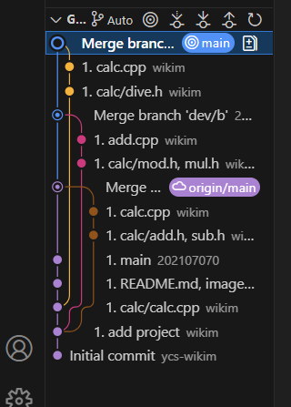

```markdown
calc
------------------------
oss 기말 프로젝트
-------------------------
저장소:https://github.com/202107070/2025oss

팀원(역할) / 업무
-------------------------
조호진(팀장 - 202107070) / main브렌치 수정 
--------------------
박영환(팀원 - 202207051) / dev/a, dev/b 브렌치 수정
----------------------
김동휘(팀원 - 202407041) / dev/c 브렌치 수정
문제해결 방법과 순서
------------------
1. main브렌치와 각 브렌치 모두 병합
2. main브렌치에서 3-way병합 완료
3. 결과 화면 캡쳐와 실행 화면 캡쳐
4. readme.md 수정

중간과정 스크린샷
------------------------


